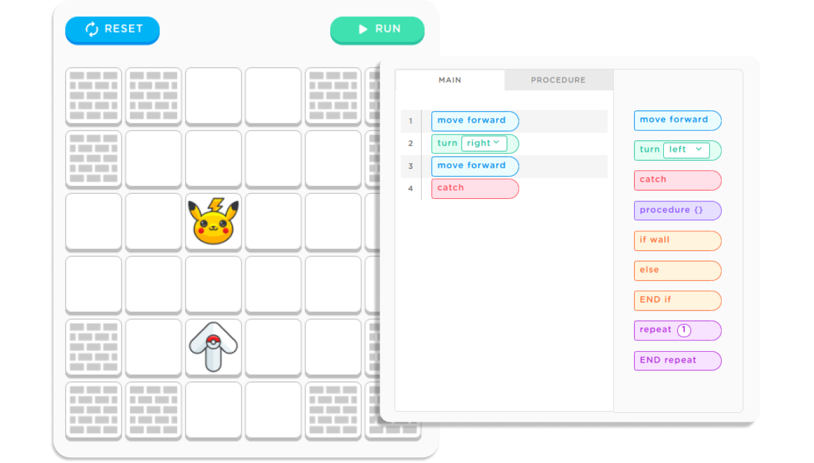

# 

Educational Coding Game for Kids

<h3>About</h3>

KidoCode is a user-friendly, web-based educational game that provides a basic understanding of programming logic through interactive code blocks.

<code>modern-web-tech</code>
<code>html5-apis</code>
<code>vanila-js</code>
<code>dom-manipulations</code>
<code>canvas</code>
<code>css3-features</code>
<code>local-storage</code>
